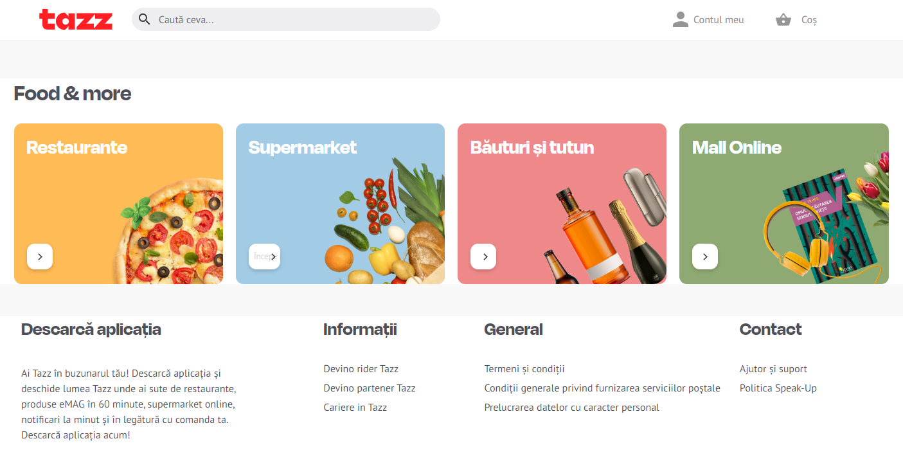

# Reproduction of tazz page

Here you will learn how to use flex [https://css-tricks.com/snippets/css/a-guide-to-flexbox/], reproducing [https://tazz.ro/craiova/oras] page using html and css (no functionality required) as seen in the following image, not the whole page

## Steps

- Clone this repo:
    - click the green Code button in github, copy the URL
    - open the Visual Studio Code in your learning folder and and write in terminal `git clone <paste_your_url_here>`
- create a separate branch `git switch -c "dev"`
- add html and css files and code
- in VS Code, click on html file and Go Live (plugin installed previously) to avoid refreshing the page on changes
- when you're done coding, add the changes to staging using + button in VS Code Source Control tab or type on terminal `git add .`
 
- commit and push the code `git commit -am "commit message here"`, `git push -u origin dev`
- go to github and raise a pull request from your development branch to master
 

## Requirements

- style the page for desktop and mobile viewing, making it responsive (use the inspector to test the look on mobile devices)
- if you need to upload images to your repo, place them all inside the images folder
- use English everywhere (page, variables naming, comments, commit messages)
- use flex for the Food & more section and for the Footer, like this:
    - for a viewport width smaller than 480px show one element on a row (tip: try changing flex-direction to column)
    - for a viewport width bigger than 480px and smaller than 640px show several elements on a row (tip: try changing flex-direction to row) and alignment along the main axis space-evenly. For the Footer align items on top (flex-start)
    - for a viewport width bigger than 640px same as before but in reverse order

